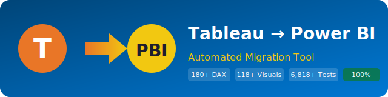

<p align="center">
  
</p>

# Contributing to Tableau to Power BI Migration Tool

Thank you for your interest in contributing! This guide covers the development setup, coding standards, and contribution workflow.

---

## Development Setup

### Prerequisites

- Python 3.12+ (tested on 3.12–3.14)
- Power BI Desktop (December 2025+) for validating output
- Git

### Getting Started

```bash
# Clone the repository
git clone <repo-url>
cd TableauToPowerBI

# Create a virtual environment
python -m venv .venv
.venv\Scripts\activate   # Windows
# source .venv/bin/activate  # macOS/Linux

# Install development dependencies
pip install -r requirements.txt

# Run tests
python -m unittest discover -s tests -v
```

### Project Structure

See [docs/ARCHITECTURE.md](docs/ARCHITECTURE.md) for a detailed architecture overview.

```
tableau_export/   → Extraction layer (Tableau XML → JSON)
powerbi_import/   → Generation layer (JSON → .pbip project)
tests/            → Unit and integration tests (7,072 tests across 141+ files)
docs/             → Documentation
examples/         → Sample Tableau workbooks
artifacts/        → Migration output
```

## Coding Standards

### No External Dependencies

The core migration pipeline uses **Python standard library only**. This is a strict design requirement:

- `xml.etree`, `json`, `os`, `re`, `uuid`, `zipfile`, `argparse`, `datetime`, `copy`, `logging`, `glob`
- Optional: `azure-identity` (deployment auth), `requests` (HTTP client), `pydantic-settings` (typed config)

If your change requires a new dependency, it must be behind a `try/except ImportError` guard.

### Style

- Follow PEP 8 with `flake8` (errors only: E9, F63, F7, F82)
- `ruff` is also configured in CI
- Maximum line length: 120 characters (soft limit)
- Use type hints where practical (validated with pyrightconfig.json)

### Naming Conventions

- Module-level functions for `tmdl_generator.py` (not a class)
- Class-based for `PBIPGenerator`, `TableauExtractor`, `ArtifactValidator`
- Private methods prefixed with `_`
- Constants as `UPPER_SNAKE_CASE`

### DAX Formulas

- All DAX output must be single-line (multi-line formulas condensed)
- Apostrophes in table names escaped: `'Name'` → `''Name''`
- Use `SELECTEDVALUE()` for scalar references (not `VALUES()`)
- Cross-table refs use `RELATED()` for manyToOne, `LOOKUPVALUE()` for manyToMany

## Testing

### Running Tests

```bash
# All tests
python -m pytest tests/ -v

# Single test file
python -m pytest tests/test_dax_converter.py -v

# Single test method
python -m pytest tests/test_dax_converter.py::TestDaxConverter::test_isnull_to_isblank -v
```

### Test Structure

| File | Focus |
|------|-------|
| `test_dax_converter.py` | DAX formula conversion |
| `test_dax_coverage.py` | DAX edge cases across all categories |
| `test_m_query_builder.py` | M query generation |
| `test_tmdl_generator.py` | TMDL semantic model |
| `test_visual_generator.py` | Visual container generation |
| `test_pbip_generator.py` | .pbip project structure |
| `test_feature_gaps.py` | Specific feature implementations |
| `test_infrastructure.py` | Validator, deployer, config |
| `test_extraction.py` | Tableau XML extraction |
| `test_prep_flow_parser.py` | Prep flow parsing |
| `test_non_regression.py` | Per-sample project regression |
| `test_integration.py` | End-to-end pipeline tests |
| `test_assessment.py` | Pre-migration assessment |
| ... | 141 test files total — see [README](README.md) for full list |

### Writing Tests

- Use `unittest.TestCase` (not pytest)
- Tests write to `tempfile.mkdtemp()` and clean up in `tearDown`
- No mocking of file I/O — tests use real temp directories
- Each test should be independent and self-contained

## Contribution Workflow

We use a **fork-based** workflow. External contributors do not have write access to the main repository — all changes come through Pull Requests.

### For External Contributors

1. **Fork** the repository on GitHub (click the "Fork" button).

2. **Clone your fork** locally:
   ```bash
   git clone https://github.com/<your-username>/TableauToPowerBI.git
   cd TableauToPowerBI
   ```

3. **Add the upstream remote** (to stay in sync):
   ```bash
   git remote add upstream https://github.com/cyphou/Tableau-To-PowerBI.git
   ```

4. **Create a feature branch** from `main`:
   ```bash
   git fetch upstream
   git checkout -b feature/your-feature-name upstream/main
   ```

5. **Make your changes**, following the coding standards above. Add tests for any new functionality and update documentation if adding new features.

6. **Run the tests** — all existing tests must pass:
   ```bash
   python -m pytest tests/ -v
   ```

7. **Validate sample migrations**:
   ```bash
   python migrate.py --batch examples/tableau_samples/ --output-dir /tmp/test_output
   ```

8. **Push to your fork** and open a Pull Request against `main`:
   ```bash
   git push origin feature/your-feature-name
   ```

9. **Open a Pull Request** on GitHub from your fork's branch to the upstream `main` branch. Provide a clear description, reference any related issues, and include before/after screenshots for visual changes.

10. **Wait for review** — CI must pass (lint + tests) and at least one maintainer must approve before merge.

### For Internal Contributors

1. Create a branch directly on the repo:
   ```bash
   git checkout -b feature/your-feature-name
   ```

2. Follow steps 5–10 above.

### Keeping Your Fork in Sync

```bash
git fetch upstream
git checkout main
git merge upstream/main
git push origin main
```

## Areas for Contribution

### High Priority

- Additional DAX conversion patterns (see GAP_ANALYSIS.md §5)
- Additional connector types for M queries
- Performance optimization for large workbooks

### Medium Priority

- New visual type mappings (see GAP_ANALYSIS.md §4)
- Enhanced formatting migration
- Integration tests with Fabric workspace

### Low Priority

- API documentation generation (sphinx/pdoc)
- Property-based testing for formula conversion
- PBIR schema validation against Microsoft's published schemas

## Release Process

1. Update `CHANGELOG.md` with the new version
2. Run full test suite: `python -m unittest discover -s tests -v`
3. Validate all sample migrations
4. Create a Git tag: `git tag v1.x.x`
5. Push to main: `git push origin main --tags`
