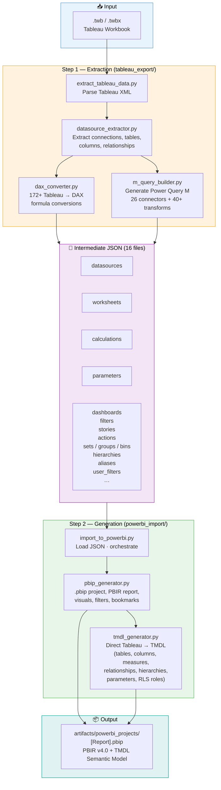

# Tableau to Power BI Migration

Automated migration tool for Tableau workbooks (`.twb`, `.twbx`) and Tableau Prep flows (`.tfl`, `.tflx`) to Power BI projects (`.pbip`) that can be opened directly in Power BI Desktop.

## Features

### Migration Engine
- **Full extraction** of datasources, tables, columns, calculations, relationships, and parameters (16 object types)
- **`.pbip` project generation** in PBIR v4.0 format with TMDL semantic model
- **172+ DAX conversions** of Tableau formulas (LOD, table calcs, IF/THEN/END, ISNULL, CONTAINS, security, stats, etc.)
- **60+ visual type mappings**: Tableau marks → Power BI visuals (bar, line, pie, scatter, map, gauge, KPI, waterfall, box plot, funnel, word cloud, combo, matrix, treemap, etc.)
- **26 connector types** in Power Query M (Excel, CSV, SQL Server, PostgreSQL, BigQuery, Oracle, MySQL, Snowflake, Teradata, SAP HANA, SAP BW, Redshift, Databricks, Spark, Azure SQL/Synapse, Google Sheets, SharePoint, JSON, XML, PDF, Salesforce, Web, etc.)
- **40+ Power Query M transformation generators**: rename, filter, aggregate, pivot/unpivot, join, union, sort, conditional columns — chainable via `inject_m_steps()`
- **165 Tableau Prep → Power Query M** operation mappings ([reference doc](docs/TABLEAU_PREP_TO_POWERQUERY_REFERENCE.md))
- **Tableau Prep flow parser** (`.tfl`/`.tflx`): converts Prep steps (Clean, Join, Aggregate, Union, Pivot) into chained Power Query M queries via `--prep` CLI flag
- **Calculated columns** vs measures: automatic classification based on Tableau role
- **Cross-table references**: automatic `RELATED()` (manyToOne) or `LOOKUPVALUE()` (manyToMany)
- **Relationship extraction**: handles both `[Table].[Column]` and bare `[Column]` join clause formats with table inference
- **Row-Level Security (RLS)**: user filters, USERNAME(), ISMEMBEROF() → Power BI RLS roles
- **Parameters**: range, list, and any-domain → What-If parameter tables with SELECTEDVALUE measures
- **Visuals** automatically positioned based on Tableau worksheets and dashboard layouts

### Visual Generator (PBIR-native)
- **Slicer sync groups**: cross-page slicer synchronization
- **Cross-filtering disable**: opt-out visuals from cross-filtering
- **Action button navigation**: page navigation and URL link buttons
- **TopN visual filters**: visual-level TopN and categorical filters
- **Sort state migration**: ascending/descending sort definitions
- **Reference lines**: constant lines on value axis
- **Conditional formatting**: color-by-measure gradients

### Semantic Model Intelligence
- **Auto date hierarchies**: Automatically creates Year → Quarter → Month → Day hierarchies for every date/dateTime column not already in a hierarchy
- **Calculation groups**: Tableau parameters that switch between measures → PBI Calculation Group tables with `CALCULATE(SELECTEDMEASURE())`
- **Field parameters**: Tableau parameters that switch between dimension columns → PBI Field Parameter tables with `NAMEOF()` references
- **Number format conversion**: Tableau `###,###` / `$#,##0` / `0.0%` patterns → Power BI `formatString`
- **Context filter promotion**: Worksheet context filters automatically promoted to page-level filters
- **Pages shelf slicer**: Tableau Pages shelf → Power BI slicer for animation playback

### Pre-Migration Assessment
- **`--assess` mode**: Run readiness analysis before migration — checks datasources, calculations, visuals, filters, data model, interactivity, and packaging
- **Scoring**: Overall readiness score (0–100) with per-category severity (pass / info / warning / fail)
- **Strategy advisor**: Recommends Import, DirectQuery, or Composite connection mode based on 7 signal types (connectors, table/column count, custom SQL, LOD complexity, Prep flows, etc.)
- **JSON report**: Assessment results saved as structured JSON for CI/CD and audit trails

### Infrastructure
- **Batch migration**: `--batch DIR` to migrate all workbooks in a directory
- **Custom output**: `--output-dir DIR` for output location
- **Structured logging**: `--verbose` and `--log-file` flags
- **Artifact validation**: validate generated .pbip projects (JSON, TMDL, report structure)
- **Fabric deployment**: deploy to Microsoft Fabric via REST API (Service Principal or Managed Identity)
- **Dry-run mode**: `--dry-run` to preview migration without writing files
- **Calendar customization**: `--calendar-start YEAR` and `--calendar-end YEAR` to set date table range
- **Culture/locale**: `--culture LOCALE` for non-en-US linguistic metadata (e.g., `fr-FR`)
- **CI/CD pipeline**: GitHub Actions with 5-stage pipeline (lint+ruff, test, strict validate+twbx, staging deploy, production deploy)
- **866 tests**: 16 test files covering all modules, 0 failures, 2 skipped

## Quick Start

### Prerequisites

- Python 3.8+
- Power BI Desktop (December 2025 or later recommended)
- No external dependencies for core migration (Python standard library only)
- Optional: `azure-identity` + `requests` for Fabric deployment, `pydantic-settings` for typed config

### One-command migration

```bash
python migrate.py your_workbook.twbx
```

### With Tableau Prep flow

```bash
python migrate.py your_workbook.twbx --prep your_flow.tflx
```

The `--prep` flag parses the Prep flow, converts all steps to Power Query M, and merges the resulting queries into the workbook's datasources before generating the Power BI project.

### Batch migration

```bash
python migrate.py --batch examples/tableau_samples/ --output-dir /tmp/output
```

### CLI options

| Flag | Description |
|------|-------------|
| `--prep FILE` | Tableau Prep flow (.tfl/.tflx) to merge |
| `--output-dir DIR` | Custom output directory (default: `artifacts/powerbi_projects/`) |
| `--verbose` / `-v` | Enable verbose (DEBUG) console logging |
| `--log-file FILE` | Write logs to a file |
| `--batch DIR` | Batch-migrate all .twb/.twbx files in a directory |
| `--skip-conversion` | Skip extraction, re-use existing JSON files |
| `--dry-run` | Preview migration without writing files |
| `--calendar-start YEAR` | Calendar table start year (default: 2020) |
| `--calendar-end YEAR` | Calendar table end year (default: 2030) |
| `--culture LOCALE` | Culture/locale for linguistic metadata (e.g., `fr-FR`) |
| `--assess` | Run pre-migration assessment and strategy analysis (no generation) |

### Output

A complete project in `artifacts/powerbi_projects/[ReportName]/`:

```
[ReportName]/
├── [ReportName].pbip                          # Double-click to open
├── migration_metadata.json                    # Migration stats and object counts
├── [ReportName].SemanticModel/
│   ├── definition.pbism
│   ├── .platform
│   └── definition/
│       ├── database.tmdl
│       ├── model.tmdl
│       ├── relationships.tmdl
│       ├── expressions.tmdl                   # Power Query M partitions
│       ├── perspectives.tmdl                  # "Full Model" perspective
│       ├── diagramLayout.json                 # Auto-filled by PBI Desktop
│       ├── cultures/
│       │   └── {locale}.tmdl                  # Linguistic metadata (configurable via --culture)
│       └── tables/
│           ├── Table1.tmdl                    # Columns + DAX measures
│           ├── Calendar.tmdl                  # Auto-generated date table
│           └── ...
└── [ReportName].Report/
    ├── definition.pbir
    ├── .platform
    └── definition/
        ├── report.json
        ├── version.json
        ├── RegisteredResources/
        │   └── TableauMigrationTheme.json     # Custom color theme
        └── pages/
            ├── pages.json
            └── ReportSection/
                ├── page.json
                └── visuals/
                    └── [id]/visual.json
```

### Step-by-step migration

```bash
# 1. Extraction only
python tableau_export/extract_tableau_data.py your_workbook.twbx

# 2. Power BI project generation
python powerbi_import/import_to_powerbi.py
```

## Architecture

```
TableauToPowerBI/
├── migrate.py                                 # CLI entry point (batch, logging, flags)
├── tableau_export/                            # Tableau extraction
│   ├── extract_tableau_data.py                #   TWB/TWBX parser
│   ├── datasource_extractor.py                #   Connection/table/calc extractor
│   ├── dax_converter.py                       #   172+ DAX formula conversions
│   ├── m_query_builder.py                     #   26 connector types + 40+ transform generators
│   └── prep_flow_parser.py                    #   Tableau Prep flow parser (.tfl/.tflx)
├── powerbi_import/                            # Power BI generation
│   ├── import_to_powerbi.py                   #   Orchestrator (supports --output-dir)
│   ├── pbip_generator.py                      #   .pbip project + visuals
│   ├── visual_generator.py                    #   60+ visual types, PBIR-native configs
│   ├── tmdl_generator.py                      #   Semantic model → TMDL
│   ├── m_query_generator.py                   #   Sample data M query generator
│   ├── assessment.py                          #   Pre-migration readiness assessment
│   ├── strategy_advisor.py                    #   Import/DirectQuery/Composite advisor
│   ├── validator.py                           #   Artifact validation (JSON, TMDL, .pbip)
│   ├── migration_report.py                    #   Per-item fidelity tracking
│   └── deploy/                                #   Fabric deployment subpackage
│       ├── auth.py                            #     Azure AD auth (Service Principal / MI)
│       ├── client.py                          #     Fabric REST API client (retry + fallback)
│       ├── deployer.py                        #     Fabric deployment orchestrator
│       ├── utils.py                           #     DeploymentReport, ArtifactCache
│       └── config/                            #     Configuration
│           ├── settings.py                    #       Env-var based settings
│           └── environments.py                #       Dev/staging/production configs
├── tests/                                     # 866 tests (16 test files)
├── docs/                                      # Documentation
├── examples/                                  # Sample Tableau files
├── .github/workflows/ci.yml                   # CI/CD pipeline
└── artifacts/                                 # Generated output
    └── powerbi_projects/                      #   .pbip projects
```

## Pipeline

```
.twbx/.twb --> extract_tableau_data.py --> 16 JSON files --+
.tfl/.tflx --> prep_flow_parser.py --> M query overrides --+--> pbip_generator.py + tmdl_generator.py --> .pbip
                                                           +-- (merge)
```

### ASCII Pipeline Diagram

```
              +-------------------------------+
              |           INPUT               |
              |  .twb / .twbx  (workbook)     |
              |  .tfl / .tflx  (Prep, opt.)   |
              +---------------+---------------+
                              |
                              v
              +-------------------------------+
              |    STEP 1 - EXTRACTION        |
              |                               |
              |  extract_tableau_data.py       |
              |    +-- datasource_extractor.py |
              |    +-- dax_converter.py        |
              |    +-- m_query_builder.py      |
              |    +-- prep_flow_parser.py     |
              +---------------+---------------+
                              |
                              v
              +-------------------------------+
              |      16 INTERMEDIATE JSON     |
              |                               |
              |  worksheets    calculations   |
              |  dashboards    parameters     |
              |  datasources   filters        |
              |  stories       actions        |
              |  sets/groups   bins            |
              |  hierarchies   sort_orders    |
              |  aliases       custom_sql     |
              |  user_filters                 |
              +---------------+---------------+
                              |
                              v
              +-------------------------------+
              |    STEP 2 - GENERATION        |
              |                               |
              |  import_to_powerbi.py         |
              |    +-- pbip_generator.py       |
              |    +-- tmdl_generator.py       |
              |    +-- visual_generator.py     |
              |    +-- validator.py            |
              +---------------+---------------+
                              |
                              v
              +-------------------------------+
              |           OUTPUT              |
              |                               |
              |  .pbip project                |
              |  PBIR v4.0 report             |
              |  TMDL semantic model          |
              |  migration_metadata.json      |
              +-------------------------------+
```

### Detailed Diagram



## DAX Conversions (172+ functions)

> **Full reference:** [docs/TABLEAU_TO_DAX_REFERENCE.md](docs/TABLEAU_TO_DAX_REFERENCE.md)

| Category | Tableau | DAX |
|----------|---------|-----|
| Logic | `IF cond THEN val ELSE val2 END` | `IF(cond, val, val2)` |
| Logic | `IF ... ELSEIF ... END` | `IF(..., ..., IF(...))` |
| Null | `ISNULL([col])` | `ISBLANK([col])` |
| Text | `CONTAINS([col], "text")` | `CONTAINSSTRING([col], "text")` |
| Agg | `COUNTD([col])` | `DISTINCTCOUNT([col])` |
| Agg | `AVG([col])` | `AVERAGE([col])` |
| Text | `ASCII([col])` | `UNICODE([col])` |
| Syntax | `==` | `=` |
| Syntax | `or` / `and` | `\|\|` / `&&` |
| Syntax | `+` (strings) | `&` |
| LOD | `{FIXED [dim] : AGG}` | `CALCULATE(AGG, ALLEXCEPT)` |
| LOD | `{EXCLUDE [dim] : AGG}` | `CALCULATE(AGG, REMOVEFILTERS)` |
| Table Calc | `RUNNING_SUM / RANK` | `CALCULATE / RANKX` |
| Iterator | `SUM(IF(...))` | `SUMX('table', IF(...))` |
| Cross-table | `[col]` other table (manyToOne) | `RELATED('Table'[col])` |
| Cross-table | `[col]` other table (manyToMany) | `LOOKUPVALUE(...)` |
| Security | `USERNAME()` | `USERPRINCIPALNAME()` |
| Stats | `MEDIAN / STDEV / PERCENTILE` | `MEDIAN / STDEV.S / PERCENTILE.INC` |

## Complex Transformation Examples

The tool handles advanced Tableau patterns end-to-end. Below are real examples from the included sample workbooks.

### LOD Expressions → CALCULATE

LOD (Level of Detail) expressions are automatically converted to `CALCULATE` with the appropriate filter context:

| Tableau LOD | Generated DAX |
|-------------|---------------|
| `{FIXED [customer_id] : SUM([quantity] * [unit_price])}` | `CALCULATE(SUM('Orders'[quantity] * 'Orders'[unit_price]), ALLEXCEPT('Orders', 'Orders'[customer_id]))` |
| `{FIXED [region], [channel] : SUM(...)}` | `CALCULATE(SUM(...), ALLEXCEPT('Orders', 'Orders'[region], 'Orders'[channel]))` |
| `{EXCLUDE [channel] : SUM(...)}` | `CALCULATE(SUM(...), REMOVEFILTERS('Orders'[channel]))` |
| `{FIXED : SUM(IF YEAR([date]) = YEAR(TODAY()) THEN [amount] ELSE 0 END)}` | `CALCULATE(SUMX('Table', IF(YEAR(...) = YEAR(TODAY()), ...)), ALL('Table'))` |

### SUM(IF) → SUMX Iterator Conversion

Tableau allows `SUM(IF ...)` with row-level logic inside an aggregate. DAX requires iterator functions:

```
Tableau:  SUM(IF [order_status] != "Cancelled" THEN [quantity] * [unit_price] * (1 - [discount]) ELSE 0 END)
DAX:      SUMX('Orders', IF('Orders'[order_status] != "Cancelled", 'Orders'[quantity] * 'Orders'[unit_price] * (1 - 'Orders'[discount]), 0))
```

This also works for `AVG(IF)` → `AVERAGEX`, `MIN(IF)` → `MINX`, `MAX(IF)` → `MAXX`, `COUNT(IF)` → `COUNTX`.

### Nested IF/ELSEIF → Nested IF()

```
Tableau:  IF [Revenue] > 10000 THEN "Platinum"
          ELSEIF [Revenue] > 5000 THEN "Gold"
          ELSEIF [Revenue] > 1000 THEN "Silver" 
          ELSE "Bronze" END

DAX:      IF([Revenue] > 10000, "Platinum", IF([Revenue] > 5000, "Gold", IF([Revenue] > 1000, "Silver", "Bronze")))
```

### Window & Table Calculations

| Tableau | Generated DAX |
|---------|---------------|
| `WINDOW_AVG(SUM([revenue]))` | `CALCULATE(SUM('Table'[revenue]), ALL('Table'))` |
| `RUNNING_SUM(SUM([quantity]))` | `CALCULATE(SUM(SUM('Table'[quantity])))` |
| `RANK(SUM([revenue]))` | `RANKX(ALL(SUM('Table'[revenue])))` |

### Cross-Table References (RELATED)

When a calculated column references a column from a related table, `RELATED()` is automatically injected:

```
Tableau calc column:    [segment]      → where segment lives in Customers table
DAX calculated column:  RELATED('Customers'[segment])     (when on Orders table, manyToOne relationship)
```

For `manyToMany` relationships, `LOOKUPVALUE()` is used instead.

### Row-Level Security (RLS) Migration

Tableau user filters and security calculations are converted to Power BI RLS roles:

| Tableau Security | Generated Power BI RLS |
|------------------|----------------------|
| `<user-filter>` with user→value mappings | Role with `USERPRINCIPALNAME() = "user@co.com" && [Col] IN {"val1", "val2"}` |
| `[Email] = USERNAME()` | Role with `[Email] = USERPRINCIPALNAME()` |
| `ISMEMBEROF("Managers")` | Separate RLS role `Managers` (assign Azure AD group) |
| `[Manager] = FULLNAME()` | Role with `[Manager] = USERPRINCIPALNAME()` |

### Parameters → What-If Tables

| Tableau Parameter | Generated Power BI |
|-------------------|-------------------|
| Integer range (min=2020, max=2030) | `GENERATESERIES(2020, 2030, 1)` table + `SELECTEDVALUE` measure |
| String list ("All", "Europe", ...) | `DATATABLE("Value", STRING, {{"All"}, {"Europe"}, ...})` table + `SELECTEDVALUE` measure |
| Real range (min=0, max=0.5, step=0.01) | `GENERATESERIES(0, 0.5, 0.01)` table + `SELECTEDVALUE` measure |

### Geographic Data Categories

Tableau semantic roles are mapped to Power BI `dataCategory` annotations:

| Tableau semantic-role | Power BI dataCategory |
|-----------------------|----------------------|
| `[City].[Name]` | `City` |
| `[State].[Name]` | `StateOrProvince` |
| `[Country].[Name]` | `Country` |
| `[ZipCode].[Name]` | `PostalCode` |
| `[Geographical].[Latitude]` | `Latitude` |
| `[Geographical].[Longitude]` | `Longitude` |

## Complex Example: Enterprise Sales

The `Enterprise_Sales.twb` sample demonstrates all advanced features in a single workbook:

```bash
python migrate.py examples/tableau_samples/Enterprise_Sales.twb
```

**Input:** 2 joined tables (Orders + Customers) from Snowflake, 22 calculations, 3 parameters, 5 worksheets, RLS rules, stories

**Generated output:**

| Component | Count | Details |
|-----------|-------|---------|
| Tables | 5 | Orders, Customers, Calendar (auto), Target Margin, Top N |
| Columns | 41 | Physical + calculated columns |
| DAX Measures | 21 | Including SUMX, CALCULATE, LOD, window functions |
| Relationships | 2 | Orders→Customers (manyToOne), Orders→Calendar |
| RLS Roles | 2 | Territory Access (user mapping), Is My Account (USERNAME) |
| Visuals | 5 | KPIs, stacked bar, line, scatter, map |
| Bookmarks | 3 | From story points |

**Key transformations performed:**

```
SUM(IF [status]!="Cancelled" THEN [qty]*[price]*(1-[discount]) ELSE 0 END)
→ SUMX('Orders', IF('Orders'[order_status] != "Cancelled", 
       'Orders'[quantity] * 'Orders'[unit_price] * (1 - 'Orders'[discount]), 0))

{FIXED [customer_id] : SUM([quantity] * [unit_price])}
→ CALCULATE(SUM('Orders'[quantity] * 'Orders'[unit_price]), 
       ALLEXCEPT('Orders', 'Orders'[customer_id]))

{FIXED : SUM(IF YEAR([order_date]) = YEAR(TODAY()) THEN [quantity]*[unit_price] ELSE 0 END)}
→ CALCULATE(SUMX('Orders', IF(YEAR('Orders'[order_date]) = YEAR(TODAY()), 
       'Orders'[quantity] * 'Orders'[unit_price], 0)), ALL('Orders'))

IF [Rev]>10000 THEN "Platinum" ELSEIF [Rev]>5000 THEN "Gold" ELSEIF [Rev]>1000 THEN "Silver" ELSE "Bronze" END
→ IF([Revenue per Customer] > 10000, "Platinum", IF([Revenue per Customer] > 5000, "Gold", 
       IF([Revenue per Customer] > 1000, "Silver", "Bronze")))
```

## Validation

Validate generated projects before opening in Power BI Desktop:

```python
from powerbi_import.validator import ArtifactValidator

# Validate a single project
result = ArtifactValidator.validate_project("artifacts/powerbi_projects/MyReport")
print(result)  # {"valid": True, "files_checked": 15, "errors": []}

# Validate all projects in a directory
results = ArtifactValidator.validate_directory("artifacts/powerbi_projects/")
```

The validator checks:
- `.pbip` file exists and is valid JSON
- Report directory contains `report.json`, `definition.pbir`, page and visual JSONs
- SemanticModel directory contains `model.tmdl` (starts with `model Model`), table TMDLs

## Fabric Deployment

Deploy generated projects to a Microsoft Fabric workspace:

```bash
# Set environment variables
export FABRIC_WORKSPACE_ID="your-workspace-guid"
export FABRIC_TENANT_ID="your-tenant-guid"
export FABRIC_CLIENT_ID="your-app-client-id"
export FABRIC_CLIENT_SECRET="your-app-secret"

# Deploy via Python
python -c "
from powerbi_import.deployer import FabricDeployer
deployer = FabricDeployer(workspace_id='your-workspace-guid')
deployer.deploy_artifacts_batch('artifacts/powerbi_projects/')
"
```

### Dependencies for deployment

```bash
pip install azure-identity requests  # Optional, only for Fabric deployment
```

The client falls back to `urllib` (stdlib) if `requests` is not installed.

### Environment configurations

| Environment | Log Level | Retry | Validate | Approval |
|-------------|-----------|-------|----------|----------|
| development | DEBUG | 3 | No | No |
| staging | INFO | 3 | Yes | No |
| production | WARNING | 5 | Yes | Yes |

## CI/CD

The project includes a GitHub Actions pipeline (`.github/workflows/ci.yml`) with 5 stages:

1. **Lint**: `flake8` (errors only) + `ruff` (style checks)
2. **Test**: Python 3.9–3.12 matrix, 717 unittest tests
3. **Strict Validate**: Run sample .twbx migrations + artifact validation with strict mode
4. **Staging Deploy**: Automated deployment to staging Fabric workspace
5. **Production Deploy**: Manual approval + deployment to production Fabric workspace

## Testing

```bash
# Run all 866+ tests
python -m pytest tests/ -v

# Run specific test file
python -m unittest tests.test_dax_converter -v
python -m unittest tests.test_visual_generator -v
python -m unittest tests.test_non_regression -v
```

| Test File | Tests | Coverage |
|-----------|-------|---------|
| `test_dax_converter.py` | 80+ | DAX formula conversions, operators, LOD, table calcs |
| `test_m_query_builder.py` | 80+ | Power Query M generation, 40+ transforms, connectors |
| `test_tmdl_generator.py` | 60+ | TMDL model building, Calendar table, file writers |
| `test_pbip_generator.py` | 40+ | Project generation, visual objects, slicers |
| `test_visual_generator.py` | 67 | 60+ visual types, sync groups, action buttons, filters |
| `test_infrastructure.py` | 34 | Validator, deployment utils, config, auth, client |
| `test_non_regression.py` | 100+ | End-to-end migration of all 8 sample workbooks |
| `test_extraction.py` | 20+ | Tableau XML extraction |
| `test_migration.py` | 20+ | Full pipeline integration |
| `test_migration_validation.py` | 15+ | Artifact validation post-migration |
| `test_assessment.py` | 55 | Pre-migration assessment categories and scoring |
| `test_strategy_advisor.py` | 26 | Strategy advisor Import/DirectQuery/Composite |
| `test_new_features.py` | 53 | Calculation groups, field parameters, visual config |
| `test_feature_gaps.py` | 44 | Feature gap coverage (LOD, parameters, RLS, etc.) |
| `test_gap_implementations.py` | 50 | Gap implementations (DAX fixes, validation, config) |
| `test_non_regression.py` | 100+ | End-to-end workbook migration regression tests |

## Documentation

- [.pbip project guide](docs/POWERBI_PROJECT_GUIDE.md)
- [Tableau - Power BI mapping reference](docs/MAPPING_REFERENCE.md)
- [172 Tableau - DAX function reference](docs/TABLEAU_TO_DAX_REFERENCE.md)
- [108 Tableau - Power Query M property reference](docs/TABLEAU_TO_POWERQUERY_REFERENCE.md)
- [165 Tableau Prep - Power Query M transformation reference](docs/TABLEAU_PREP_TO_POWERQUERY_REFERENCE.md)
- [Architecture overview](docs/ARCHITECTURE.md)
- [Comprehensive gap analysis](docs/GAP_ANALYSIS.md)
- [Known limitations](docs/KNOWN_LIMITATIONS.md)
- [Migration checklist](docs/MIGRATION_CHECKLIST.md)
- [Deployment guide](docs/DEPLOYMENT_GUIDE.md)
- [Contributing guide](CONTRIBUTING.md)
- [Tableau version compatibility](docs/TABLEAU_VERSION_COMPATIBILITY.md)
- [FAQ](docs/FAQ.md)

## Known Limitations

- `MAKEPOINT()` (Tableau spatial) has no DAX equivalent -- ignored
- `PREVIOUS_VALUE()` / `LOOKUP()` require manual conversion
- Data source paths must be reconfigured in Power Query after migration
- Some table calculations (`INDEX()`, `SIZE()`) are approximated
- Fabric deployment requires `azure-identity` and a registered Azure AD application
- `.hyper` file data is not read (only XML metadata)
- Nested LOD expressions (LOD inside LOD) may miss edge cases
- Tableau 2024.3+ features (dynamic zone visibility, dynamic parameters) are not extracted
- See [docs/KNOWN_LIMITATIONS.md](docs/KNOWN_LIMITATIONS.md) for the full list
