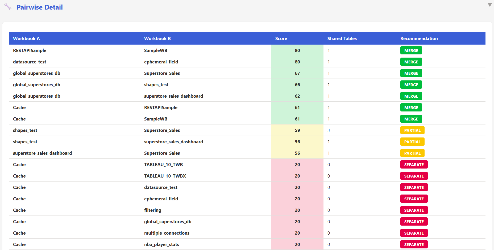

# Shared Semantic Model Extension — Architecture & Sprint Plan

**Version:** v13.0.0  
**Date:** 2026-03-16  
**Status:** PLANNING  
**Codename:** "Unified Model"

---

## 1. Executive Summary

When migrating multiple Tableau workbooks that share the same data sources (e.g., "Sales Overview", "Sales Detail", "Sales Forecast" all connecting to the same SQL Server database), the current tool generates **one semantic model per workbook** — duplicating table definitions, relationships, measures, and Power Query M expressions.

This extension introduces a **Shared Semantic Model** pipeline:

```
Multiple .twbx ──→ [Extract All] ──→ [Assess & Merge] ──→ 1 Shared SemanticModel
                                                        ──→ N Thin Reports (each .pbir → byPath to shared model)
```

**Power BI Best Practice Alignment:** This follows the Microsoft-recommended "thin report" pattern where multiple reports connect to a single semantic model, enabling:
- Consistent KPI definitions across reports
- Single source of truth for business logic
- Reduced data duplication and refresh costs
- Easier governance and certification

---

## 2. Architecture Overview

### 2.1 Current Pipeline (Per-Workbook)

```
Workbook A.twbx ──→ Extract ──→ A.pbip (A.SemanticModel + A.Report)
Workbook B.twbx ──→ Extract ──→ B.pbip (B.SemanticModel + B.Report)
Workbook C.twbx ──→ Extract ──→ C.pbip (C.SemanticModel + C.Report)
```

Each `.pbip` is self-contained: its `.Report/definition.pbir` references `../A.SemanticModel` via `byPath`.

### 2.2 New Pipeline (Shared Model)

```
                                    ┌─────────────────────────────────────┐
Workbook A.twbx ─┐                  │  SharedModel.SemanticModel/         │
                 ├──→ Extract All ──→│    tables/ (union of all tables)    │
Workbook B.twbx ─┤   & Merge       │    relationships (deduplicated)     │
                 │                  │    measures (merged + namespaced)   │
Workbook C.twbx ─┘                  │    M queries (unified connections)  │
                                    └─────────────────────────────────────┘
                                                     ▲
                            ┌────────────────────────┤────────────────────────┐
                            │                        │                        │
                    A.Report/                 B.Report/                C.Report/
                    definition.pbir           definition.pbir          definition.pbir
                    byPath: ../Shared...      byPath: ../Shared...     byPath: ../Shared...
```

### 2.3 Output Directory Structure

```
output/
├── SharedProject.pbip                    # Main project (optional, for PBI Desktop)
├── SharedProject.SemanticModel/          # THE shared semantic model
│   ├── .platform
│   ├── definition.pbism
│   └── definition/
│       ├── database.tmdl
│       ├── model.tmdl
│       ├── relationships.tmdl
│       ├── expressions.tmdl
│       ├── tables/
│       │   ├── Orders.tmdl
│       │   ├── Customers.tmdl
│       │   └── ...
│       └── ...
├── WorkbookA.Report/                     # Thin report A
│   ├── .platform
│   ├── definition.pbir                   # byPath → ../SharedProject.SemanticModel
│   └── definition/
│       ├── report.json
│       └── pages/...
├── WorkbookB.Report/                     # Thin report B
│   ├── .platform
│   ├── definition.pbir                   # byPath → ../SharedProject.SemanticModel
│   └── definition/
│       ├── report.json
│       └── pages/...
└── merge_assessment.json                 # Merge analysis report
```

---

## 3. Key Design Decisions

### 3.1 Table Identity & Matching

Two tables from different workbooks are considered the **same** if they match on:

| Signal | Weight | Description |
|--------|--------|-------------|
| **Connection fingerprint** | Required | Same server+database+schema (normalized) |
| **Physical table name** | Required | Same `[schema].[table]` in the source database |
| **Column overlap** | Validation | ≥70% column name overlap confirms match |

**Fingerprint formula:**
```python
fingerprint = hash(f"{connection_type}|{server.lower()}|{database.lower()}|{schema.lower()}|{table_name.lower()}")
```

Tables that connect to different servers/databases are **never merged**, even if they share the same name.

### 3.2 Measure Conflict Resolution

When workbooks define different measures with the same name on the same table:

| Scenario | Resolution |
|----------|-----------|
| Same name + same DAX formula | Keep one (deduplicate) |
| Same name + different DAX formula | Namespace: `[Measure] (WorkbookA)`, `[Measure] (WorkbookB)` |
| Unique measure name | Keep as-is |

### 3.3 Calculated Column Conflict Resolution

| Scenario | Resolution |
|----------|-----------|
| Same name + same expression | Keep one |
| Same name + different expression | Namespace with workbook suffix |
| Unique name | Keep as-is |

### 3.4 Relationship Deduplication

Relationships are deduplicated by `(fromTable, fromColumn, toTable, toColumn)` key. If two workbooks define the same relationship with different cardinality, the **manyToOne** variant wins (more restrictive = safer).

### 3.5 Parameter Handling

Parameters are workbook-scoped by nature. Strategy:
- **Same parameter name + same type + same default** → deduplicate
- **Same name + different config** → namespace: `ParamName (WorkbookA)`
- Parameter tables (`GENERATESERIES` / `DATATABLE`) follow the same logic

### 3.6 RLS Role Merging

- Identical role definitions → keep one
- Different roles → keep all with unique names (prefix workbook if collision)
- `tablePermission` targets remain valid since tables are shared

---

## 4. CLI Interface

### New Flags

```bash
# Shared model migration — provide multiple workbooks
python migrate.py --shared-model workbook1.twbx workbook2.twbx workbook3.twbx

# Shared model from a batch directory
python migrate.py --batch examples/tableau_samples/ --shared-model

# Shared model with custom name
python migrate.py --shared-model wb1.twbx wb2.twbx --model-name "Sales Analytics"

# Assessment only (no generation)
python migrate.py --shared-model wb1.twbx wb2.twbx --assess-merge

# Force merge (skip column overlap validation)
python migrate.py --shared-model wb1.twbx wb2.twbx --force-merge

# Output directory
python migrate.py --shared-model wb1.twbx wb2.twbx --output-dir /tmp/shared_output
```

### Assessment Output

```bash
$ python migrate.py --shared-model wb1.twbx wb2.twbx --assess-merge

╔══════════════════════════════════════════════════════════════╗
║          Shared Semantic Model — Merge Assessment           ║
╠══════════════════════════════════════════════════════════════╣
║ Workbooks analyzed: 3                                       ║
║ Total tables found: 18                                      ║
║ Unique tables (after merge): 11                             ║
║ Tables saved by merging: 7 (39%)                            ║
╠══════════════════════════════════════════════════════════════╣
║                                                              ║
║ MERGE CANDIDATES (same connection + table name):            ║
║                                                              ║
║  ✅ Orders        — found in 3/3 workbooks (100% col match) ║
║  ✅ Customers     — found in 2/3 workbooks (95% col match)  ║
║  ✅ Products      — found in 3/3 workbooks (88% col match)  ║
║  ⚠️  Calendar     — found in 2/3 workbooks (auto-generated) ║
║                                                              ║
║ CONFLICTS:                                                   ║
║  ⚠️  [Total Sales] — different DAX in wb1 vs wb2            ║
║     wb1: SUM('Orders'[Amount])                              ║
║     wb2: SUMX('Orders', [Qty] * [Price])                    ║
║     → Will create [Total Sales (wb1)] and [Total Sales (wb2)]║
║                                                              ║
║ UNIQUE TABLES (no merge possible):                          ║
║  📄 Forecast — only in wb3                                  ║
║  📄 Targets  — only in wb2                                  ║
║                                                              ║
║ MEASURES: 45 total, 12 duplicates removed, 3 conflicts      ║
║ RELATIONSHIPS: 15 total, 6 duplicates removed               ║
║ PARAMETERS: 5 total, 2 duplicates removed                   ║
║ RLS ROLES: 2 total, 0 conflicts                             ║
║                                                              ║
║ RECOMMENDATION: ✅ MERGE RECOMMENDED                         ║
║ Merge score: 78/100 (high overlap)                          ║
╚══════════════════════════════════════════════════════════════╝
```

---

## 5. New Modules

### 5.1 `powerbi_import/shared_model.py` — Core Merge Engine

The main module containing all merge logic.

```python
# Key classes and functions:

class TableFingerprint:
    """Uniquely identifies a physical table across workbooks."""
    connection_type: str
    server: str
    database: str
    schema: str
    table_name: str
    
    def fingerprint(self) -> str:
        """Normalized hash key for matching."""

class MergeCandidate:
    """A table that appears in multiple workbooks."""
    fingerprint: TableFingerprint
    sources: list  # [(workbook_name, table_dict, connection_dict), ...]
    column_overlap: float  # 0.0–1.0
    conflicts: list  # Column type mismatches, etc.

class MeasureConflict:
    """A measure with the same name but different DAX across workbooks."""
    name: str
    table: str
    variants: dict  # {workbook_name: dax_formula}

class MergeAssessment:
    """Complete analysis of merge feasibility."""
    workbooks: list[str]
    merge_candidates: list[MergeCandidate]
    unique_tables: dict  # {workbook: [tables only in this workbook]}
    measure_conflicts: list[MeasureConflict]
    relationship_duplicates: int
    parameter_conflicts: list
    rls_conflicts: list
    merge_score: int  # 0-100
    recommendation: str  # "merge" | "partial" | "separate"

def assess_merge(extracted_data_list: list[dict]) -> MergeAssessment:
    """
    Analyze multiple extracted workbook datasets for merge potential.
    
    Args:
        extracted_data_list: List of converted_objects dicts (one per workbook),
                            each containing {datasources, worksheets, calculations, ...}
    
    Returns:
        MergeAssessment with full analysis.
    """

def merge_semantic_models(extracted_data_list: list[dict], 
                          assessment: MergeAssessment,
                          model_name: str) -> dict:
    """
    Merge multiple workbook extractions into a single unified semantic model input.
    
    Returns:
        A single converted_objects dict with merged datasources, calculations,
        parameters, relationships, etc. suitable for tmdl_generator.generate_tmdl().
    """

def build_table_fingerprints(datasources: list[dict]) -> dict[str, TableFingerprint]:
    """
    Build fingerprints for all tables in a workbook's datasources.
    
    Returns:
        {table_name: TableFingerprint}
    """

def compute_column_overlap(table_a: dict, table_b: dict) -> float:
    """
    Compute Jaccard similarity of column names between two tables.
    
    Returns:
        Float 0.0–1.0 representing column name overlap.
    """

def merge_tables(candidates: list[MergeCandidate]) -> list[dict]:
    """
    Merge table definitions: union of columns, resolve type mismatches.
    """

def merge_measures(tables_measures: dict, workbook_names: list[str]) -> tuple[list, list]:
    """
    Merge measures across workbooks. Returns (merged_measures, conflicts).
    """

def merge_relationships(all_relationships: list[list[dict]]) -> list[dict]:
    """
    Deduplicate relationships by (fromTable, fromColumn, toTable, toColumn).
    """

def merge_m_queries(all_datasources: list[list[dict]], 
                    merged_tables: list[dict]) -> dict:
    """
    Unify Power Query M expressions for merged tables.
    Pick the richest M query (most transformation steps) when duplicates exist.
    """
```

### 5.2 `powerbi_import/thin_report_generator.py` — Thin Report Builder

Generates report-only `.Report/` directories that reference a shared semantic model.

```python
class ThinReportGenerator:
    """Generates a thin report (.Report/) referencing an external semantic model."""
    
    def __init__(self, semantic_model_name: str, output_dir: str):
        """
        Args:
            semantic_model_name: Name of the shared semantic model directory
            output_dir: Root output directory
        """
    
    def generate_thin_report(self, report_name: str, 
                             converted_objects: dict,
                             field_mapping: dict = None) -> str:
        """
        Generate a thin report referencing the shared semantic model.
        
        Args:
            report_name: Name for the report
            converted_objects: Original workbook's extracted objects (worksheets, dashboards, etc.)
            field_mapping: Optional mapping of workbook-specific field names to merged names
                          e.g., {"Total Sales": "Total Sales (SalesOverview)"}
        
        Returns:
            Path to the generated report directory.
        """
    
    def create_report_pbir(self, report_dir: str, semantic_model_name: str):
        """
        Write definition.pbir with byPath reference to external semantic model.
        
        Output:
        {
            "$schema": "...fabric/item/report/definitionProperties/2.0.0/schema.json",
            "version": "4.0",
            "datasetReference": {
                "byPath": {
                    "path": f"../{semantic_model_name}.SemanticModel"
                }
            }
        }
        """
    
    def remap_visual_fields(self, visuals: list[dict], 
                            field_mapping: dict) -> list[dict]:
        """
        Update visual query bindings when measure/column names were 
        namespaced during merge (e.g., [Total Sales] → [Total Sales (wb1)]).
        """
```

### 5.3 `powerbi_import/merge_assessment.py` — Assessment Reporter

Generates the merge assessment report (JSON + console output).

```python
def generate_merge_report(assessment: MergeAssessment, 
                          output_path: str = None) -> dict:
    """
    Generate a detailed merge assessment report.
    
    Outputs:
        - merge_assessment.json (machine-readable)
        - Console summary (human-readable)
    """

def print_merge_summary(assessment: MergeAssessment):
    """Print the formatted console summary."""

def calculate_merge_score(assessment: MergeAssessment) -> int:
    """
    Calculate a 0-100 merge score based on:
    - Table overlap ratio (0-40 points)
    - Column match quality (0-20 points)
    - Measure conflict ratio (0-20 points)
    - Connection homogeneity (0-20 points)
    """
```

### 5.4 Changes to Existing Modules

#### `migrate.py` — New CLI Arguments & Orchestration

```python
# New argument group
shared_group = parser.add_argument_group('Shared Semantic Model')
shared_group.add_argument('--shared-model', nargs='*', metavar='WORKBOOK',
                          help='Merge multiple workbooks into a shared semantic model')
shared_group.add_argument('--model-name', type=str, default=None,
                          help='Name for the shared semantic model')
shared_group.add_argument('--assess-merge', action='store_true',
                          help='Only assess merge feasibility, do not generate')
shared_group.add_argument('--force-merge', action='store_true',
                          help='Force merge even with low column overlap')

# New orchestration function
def run_shared_model_migration(workbook_paths, model_name, output_dir, ...):
    """
    1. Extract ALL workbooks (to separate temp dirs to avoid overwriting)
    2. Load all converted_objects into memory
    3. Run merge assessment
    4. If assessment passes (or --force-merge): merge into shared model
    5. Generate shared SemanticModel via tmdl_generator
    6. Generate thin reports for each workbook via thin_report_generator
    7. Output merge_assessment.json
    """
```

#### `powerbi_import/import_to_powerbi.py` — Shared Model Generation Path

```python
class PowerBIImporter:
    def import_shared_model(self, model_name: str, 
                            all_converted_objects: list[dict],
                            workbook_names: list[str],
                            output_dir: str = None, ...):
        """
        Generate a shared semantic model + thin reports.
        
        Instead of calling generate_project() per workbook, this:
        1. Merges all converted_objects into one unified dataset
        2. Generates ONE SemanticModel (via tmdl_generator)
        3. Generates N Reports (via thin_report_generator)
        """
```

#### `powerbi_import/pbip_generator.py` — Thin Report Support

```python
class PowerBIProjectGenerator:
    def generate_thin_report_project(self, project_dir, report_name, 
                                     semantic_model_name, converted_objects, ...):
        """
        Generate a report-only project (no SemanticModel directory).
        The definition.pbir points to the shared semantic model via byPath.
        """
    
    def create_report_structure_external(self, project_dir, report_name, 
                                         semantic_model_name, converted_objects):
        """
        Like create_report_structure() but writes byPath to an external 
        semantic model name instead of report_name.SemanticModel.
        """
```

#### `tableau_export/extract_tableau_data.py` — Isolated Extraction

```python
class TableauExtractor:
    def extract_all_to_dir(self, output_dir: str) -> bool:
        """
        Extract to a specific directory (not the default tableau_export/).
        This avoids overwriting when extracting multiple workbooks.
        """
```

---

## 6. Sprint Plan

### Sprint 40 — Foundation: Isolated Extraction & Table Fingerprinting

**Goal:** Enable extracting multiple workbooks without overwriting + build table matching logic.

| # | Item | File(s) | Acceptance Criteria |
|---|------|---------|-------------------|
| 40.1 | **Isolated extraction** | `tableau_export/extract_tableau_data.py` | `extract_all_to_dir(path)` writes all 16 JSONs to a specified directory instead of hard-coded `tableau_export/`. Existing `extract_all()` unchanged (backwards compatible). |
| 40.2 | **Table fingerprinting** | `powerbi_import/shared_model.py` | `TableFingerprint` class + `build_table_fingerprints()`. Normalizes server/database/schema/table names. Unit tests: same table from 2 workbooks → same fingerprint. Different server → different fingerprint. |
| 40.3 | **Column overlap scoring** | `powerbi_import/shared_model.py` | `compute_column_overlap()` returns Jaccard similarity 0.0–1.0. Tests: identical tables → 1.0, disjoint → 0.0, partial → correct ratio. |
| 40.4 | **Merge candidate detection** | `powerbi_import/shared_model.py` | `assess_merge()` identifies which tables appear in multiple workbooks. Returns `MergeAssessment` with `merge_candidates` list. |
| 40.5 | **Tests: sprint 40** | `tests/test_shared_model.py` | ≥30 tests covering fingerprinting, column overlap, merge candidate detection with factory-built test data. |

**Test signatures:**
```python
class TestTableFingerprint(unittest.TestCase):
    def test_same_table_same_fingerprint(self): ...
    def test_different_server_different_fingerprint(self): ...
    def test_case_insensitive_matching(self): ...
    def test_schema_normalization(self): ...

class TestColumnOverlap(unittest.TestCase):
    def test_identical_columns_returns_1(self): ...
    def test_disjoint_columns_returns_0(self): ...
    def test_partial_overlap_correct_ratio(self): ...
    def test_empty_table_returns_0(self): ...

class TestMergeCandidateDetection(unittest.TestCase):
    def test_two_workbooks_shared_table(self): ...
    def test_no_overlap_returns_empty(self): ...
    def test_multiple_shared_tables(self): ...
    def test_different_connections_not_merged(self): ...
```

---

### Sprint 41 — Measure & Relationship Merging

**Goal:** Merge measures (with conflict detection) and deduplicate relationships.

| # | Item | File(s) | Acceptance Criteria |
|---|------|---------|-------------------|
| 41.1 | **Measure conflict detection** | `powerbi_import/shared_model.py` | `merge_measures()` identifies identical vs conflicting measures. Same name + same DAX → keep one. Same name + different DAX → namespace with workbook suffix. |
| 41.2 | **Calculated column merging** | `powerbi_import/shared_model.py` | Same logic as measures for calc columns. DAX and M-based calc columns handled. |
| 41.3 | **Relationship deduplication** | `powerbi_import/shared_model.py` | `merge_relationships()` deduplicates by (from, to) key. Cardinality conflict → prefer manyToOne. |
| 41.4 | **Parameter merging** | `powerbi_import/shared_model.py` | Parameters deduplicated by name+type+default. Conflicts namespaced. |
| 41.5 | **RLS role merging** | `powerbi_import/shared_model.py` | Identical roles deduplicated. Name collisions resolved. |
| 41.6 | **Tests: sprint 41** | `tests/test_shared_model.py` | ≥40 new tests covering all merge scenarios + edge cases. |

**Test signatures:**
```python
class TestMeasureMerging(unittest.TestCase):
    def test_identical_measures_deduplicated(self): ...
    def test_conflicting_measures_namespaced(self): ...
    def test_unique_measures_kept(self): ...
    def test_namespace_format(self): ...

class TestRelationshipMerging(unittest.TestCase):
    def test_duplicate_relationships_removed(self): ...
    def test_cardinality_conflict_prefers_many_to_one(self): ...
    def test_unique_relationships_preserved(self): ...

class TestParameterMerging(unittest.TestCase):
    def test_identical_params_deduplicated(self): ...
    def test_conflicting_params_namespaced(self): ...
```

---

### Sprint 42 — Table Merging & Power Query M Unification

**Goal:** Merge table definitions (columns union) and unify M queries.

| # | Item | File(s) | Acceptance Criteria |
|---|------|---------|-------------------|
| 42.1 | **Table column merging** | `powerbi_import/shared_model.py` | `merge_tables()` creates union of columns from all workbook variants. Type mismatches resolved (wider type wins). Extra columns from any workbook are included. |
| 42.2 | **M query selection** | `powerbi_import/shared_model.py` | `merge_m_queries()` picks the richest M query when multiple workbooks define different M for the same table. "Richest" = most transformation steps. |
| 42.3 | **Column metadata merging** | `powerbi_import/shared_model.py` | Merged columns preserve: hidden flags (hidden if hidden in ALL workbooks), semantic roles, descriptions, formats (first non-empty wins). |
| 42.4 | **Hierarchy merging** | `powerbi_import/shared_model.py` | Hierarchies deduplicated by name+table+levels. Unique hierarchies preserved. |
| 42.5 | **Sets/Groups/Bins merging** | `powerbi_import/shared_model.py` | Deduplicated by name+table+expression. |
| 42.6 | **Full merge_semantic_models()** | `powerbi_import/shared_model.py` | Top-level function that calls all merge sub-functions and returns a unified `converted_objects` dict. |
| 42.7 | **Tests: sprint 42** | `tests/test_shared_model.py` | ≥40 new tests. |

**Test signatures:**
```python
class TestTableMerging(unittest.TestCase):
    def test_column_union(self): ...
    def test_type_mismatch_wider_wins(self): ...
    def test_extra_columns_included(self): ...
    def test_hidden_flag_all_hidden(self): ...

class TestMQueryMerging(unittest.TestCase):
    def test_picks_richest_query(self): ...
    def test_identical_queries_deduplicated(self): ...
    def test_different_connections_separate(self): ...
```

---

### Sprint 43 — Merge Assessment Report

**Goal:** Build the assessment report module (JSON + console output).

| # | Item | File(s) | Acceptance Criteria |
|---|------|---------|-------------------|
| 43.1 | **Merge score calculation** | `powerbi_import/merge_assessment.py` | `calculate_merge_score()` returns 0-100 based on 4 dimensions. |
| 43.2 | **JSON report generation** | `powerbi_import/merge_assessment.py` | `generate_merge_report()` writes `merge_assessment.json` with all candidates, conflicts, scores. |
| 43.3 | **Console summary** | `powerbi_import/merge_assessment.py` | `print_merge_summary()` renders the formatted table (like existing assessment.py pattern). |
| 43.4 | **Recommendation engine** | `powerbi_import/merge_assessment.py` | Score ≥60 → "merge recommended", 30-59 → "partial merge", <30 → "keep separate". |
| 43.5 | **Tests: sprint 43** | `tests/test_merge_assessment.py` | ≥25 tests covering scoring, report generation, edge cases. |

---

### Sprint 44 — Thin Report Generator

**Goal:** Build the thin report generator that creates report-only projects.

| # | Item | File(s) | Acceptance Criteria |
|---|------|---------|-------------------|
| 44.1 | **ThinReportGenerator class** | `powerbi_import/thin_report_generator.py` | Creates `.Report/` directory with `definition.pbir` pointing to `../{model_name}.SemanticModel`. |
| 44.2 | **Field remapping** | `powerbi_import/thin_report_generator.py` | `remap_visual_fields()` updates visual query bindings when measures were namespaced during merge. |
| 44.3 | **Extend pbip_generator** | `powerbi_import/pbip_generator.py` | `create_report_structure_external()` method + `generate_thin_report_project()`. Reuses existing visual/page/filter generation logic. |
| 44.4 | **Report .pbip for thin reports** | `powerbi_import/thin_report_generator.py` | Each thin report gets its own `.pbip` file (without `artifacts[].report.semanticModel` section). |
| 44.5 | **Tests: sprint 44** | `tests/test_thin_report.py` | ≥30 tests: byPath correctness, field remapping, visual generation, filter inheritance. |

**Test signatures:**
```python
class TestThinReportGenerator(unittest.TestCase):
    def test_definition_pbir_bypath(self): ...
    def test_no_semantic_model_directory_created(self): ...
    def test_visuals_generated_correctly(self): ...
    def test_field_remapping_namespaced_measure(self): ...
    def test_filters_reference_shared_model(self): ...
    def test_theme_copied(self): ...
```

---

### Sprint 45 — CLI Orchestration & Integration

**Goal:** Wire everything together in `migrate.py` + `import_to_powerbi.py`.

| # | Item | File(s) | Acceptance Criteria |
|---|------|---------|-------------------|
| 45.1 | **CLI arguments** | `migrate.py` | `--shared-model`, `--model-name`, `--assess-merge`, `--force-merge` arguments parsed and validated. |
| 45.2 | **Isolated extraction loop** | `migrate.py` | `run_shared_model_migration()` extracts each workbook to `tempfile.mkdtemp()`, loads extracted data, cleans up temp dirs. |
| 45.3 | **Orchestration pipeline** | `migrate.py` | Full flow: extract all → assess → merge → generate shared model → generate thin reports → write assessment report. |
| 45.4 | **Batch + shared-model combo** | `migrate.py` | `--batch dir/ --shared-model` discovers all workbooks in directory and applies shared model logic. |
| 45.5 | **import_to_powerbi integration** | `powerbi_import/import_to_powerbi.py` | `PowerBIImporter.import_shared_model()` method. |
| 45.6 | **Error handling** | `migrate.py` | Graceful failure if extraction fails for one workbook (skip + warn, continue with others). |
| 45.7 | **Tests: sprint 45** | `tests/test_shared_model_cli.py` | ≥25 integration tests with mocked extraction. |

---

### Sprint 46 — End-to-End Testing & Documentation

**Goal:** Full end-to-end tests with real-world-like data + documentation.

| # | Item | File(s) | Acceptance Criteria |
|---|------|---------|-------------------|
| 46.1 | **E2E test: 2 workbooks, same datasource** | `tests/test_shared_model_e2e.py` | Complete round-trip: 2 fake workbooks → shared model + 2 thin reports. Validate TMDL structure, relationship count, measure deduplication. |
| 46.2 | **E2E test: 3 workbooks, partial overlap** | `tests/test_shared_model_e2e.py` | Mix of shared and unique tables. Assessment report verifies correct scoring. |
| 46.3 | **E2E test: no overlap** | `tests/test_shared_model_e2e.py` | Two unrelated workbooks → recommendation "keep separate". |
| 46.4 | **E2E test: measure conflicts** | `tests/test_shared_model_e2e.py` | Same measure name, different DAX → namespaced + visual field remapping verified. |
| 46.5 | **Documentation** | `docs/SHARED_MODEL_GUIDE.md` | User guide with examples, CLI reference, FAQ. |
| 46.6 | **Update existing docs** | Various | `README.md`, `DEVELOPMENT_PLAN.md`, `GAP_ANALYSIS.md`, `CHANGELOG.md`, `copilot-instructions.md`. |
| 46.7 | **CI integration** | `.github/workflows/ci.yml` | Shared model tests added to CI pipeline. |

---

### Sprint 47 — Advanced Features & Hardening

**Goal:** Handle edge cases and advanced scenarios.

| # | Item | File(s) | Acceptance Criteria |
|---|------|---------|-------------------|
| 47.1 | **Cross-datasource tables** | `powerbi_import/shared_model.py` | Handle workbooks connecting to same table via different datasource names (caption vs internal name). |
| 47.2 | **Calendar table merging** | `powerbi_import/shared_model.py` | Auto-generated Calendar tables merged into one (widest date range wins). |
| 47.3 | **Display folder organization** | `powerbi_import/shared_model.py` | Namespaced measures grouped into display folders: `Measures/WorkbookA`, `Measures/WorkbookB`. |
| 47.4 | **Incremental merge** | `powerbi_import/shared_model.py` | Re-run with additional workbook → merges into existing shared model without regenerating from scratch. |
| 47.5 | **Merge policy config** | `config.example.json` | JSON config for merge policies: `column_overlap_threshold`, `auto_namespace`, `keep_hidden_columns`, `calendar_merge_strategy`. |
| 47.6 | **Tests: sprint 47** | Various | ≥30 tests for edge cases. |

---

## 7. Risk Analysis

| Risk | Impact | Mitigation |
|------|--------|-----------|
| **Table name collisions across databases** | False merge | Fingerprint includes server+database — physical match required |
| **Measure semantics differ despite same DAX** | Wrong KPIs | Namespace with workbook name → user manually consolidates |
| **M query incompatibility** | Refresh failures | Pick richest M query; log warnings for discrepancies |
| **Visual field references break after remapping** | Blank visuals | Field remapping covers all visual query bindings (measures, columns, filters) |
| **Performance with many workbooks** | Memory pressure | Lazy loading — extract → process → discard per workbook |
| **Regression on existing single-workbook flow** | Breaking change | `--shared-model` is opt-in; existing pipeline unchanged |

---

## 8. Success Metrics

| Metric | Target |
|--------|--------|
| Test count for new modules | ≥200 new tests |
| Table deduplication accuracy | 100% (no false merges) |
| Measure conflict detection | 100% (all conflicts flagged) |
| Generated thin reports open in PBI Desktop | Yes, without errors |
| Existing test suite regression | 0 failures |
| assessment.json machine-readable | Valid JSON, parseable by downstream tools |

---

## 9. Dependencies & Prerequisites

- **No new external dependencies** — consistent with project philosophy (stdlib only)
- **Power BI Desktop December 2025+** — required for PBIR v4.0 thin report support
- **Python 3.8+** — unchanged

---

## 10. Global Assessment (`--global-assess`)

When migrating a large portfolio of Tableau workbooks, use the **Global Assessment** to automatically identify which workbooks should be merged together.

### 10.1 How It Works

```
N workbooks ──→ [Extract All] ──→ [Pairwise Scoring N×(N-1)/2] ──→ [Cluster Detection (BFS)] ──→ HTML Report
```

1. **Extract** each workbook to build table fingerprints
2. **Pairwise scoring** — compute merge scores for every pair of workbooks using `assess_merge()`
3. **Cluster detection** — build connected components via BFS (edges = pairs with score ≥ 30)
4. **Classify** workbooks as clustered (merge candidates) or isolated (migrate individually)

### 10.2 CLI Usage

```bash
# Assess all workbooks in a directory
python migrate.py --global-assess --batch examples/tableau_samples/

# Assess specific workbooks
python migrate.py --global-assess wb1.twbx wb2.twbx wb3.twbx wb4.twbx

# Custom output directory
python migrate.py --global-assess --batch folder/ --output-dir /tmp/assessment
```

### 10.3 HTML Report

The generated HTML report includes:
- **Executive Summary** — cluster count, isolated count, total tables/measures
- **Workbook Inventory** — per-workbook stats (tables, measures, connectors, cluster status)
- **Pairwise Merge Score Matrix** — N×N color-coded heatmap (green ≥60, yellow ≥30, red <30)
- **Merge Cluster Cards** — shared tables, column overlap bars, conflicts, ready-to-run CLI commands
- **Isolated Workbooks** — table with individual migration commands
- **Pairwise Detail** — sorted list of all pair scores with recommendations



### 10.4 Module: `powerbi_import/global_assessment.py`

```python
from powerbi_import.global_assessment import (
    run_global_assessment,
    print_global_summary,
    generate_global_html_report,
    save_global_assessment_json,
)

result = run_global_assessment(all_extracted, workbook_names)
print_global_summary(result)
generate_global_html_report(result, output_path="global_assessment.html")
```

Key data classes:
- `WorkbookProfile` — per-workbook stats (tables, measures, relationships, connectors)
- `PairwiseScore` — merge score between two workbooks (score, shared tables, recommendation)
- `MergeCluster` — group of workbooks recommended for merging (shared tables, avg score, full assessment)
- `GlobalAssessment` — top-level result (profiles, pairwise scores, clusters, isolated workbooks)

---

## 11. Fabric Bundle Deployment (`--deploy-bundle`)

Deploy the shared semantic model project (SemanticModel + thin reports) to a Fabric workspace as an atomic bundle.

### 11.1 How It Works

```
Project Directory ──→ [Discover Artifacts] ──→ [Deploy SemanticModel] ──→ [Deploy Reports] ──→ [Rebind] ──→ [Refresh]
```

1. **Discover** `.SemanticModel` and `.Report` directories in the project
2. **Deploy semantic model** first (reports depend on it)
3. **Deploy each report** with per-report error isolation
4. **Rebind** each report to the deployed semantic model
5. **Optional refresh** — trigger dataset refresh on the semantic model

### 11.2 CLI Usage

```bash
# Deploy after shared model migration
python migrate.py --shared-model wb1.twbx wb2.twbx --deploy-bundle WORKSPACE_ID

# Deploy with dataset refresh
python migrate.py --shared-model wb1.twbx wb2.twbx --deploy-bundle WORKSPACE_ID --bundle-refresh

# Deploy an existing project directory
python migrate.py --deploy-bundle WORKSPACE_ID --output-dir artifacts/shared/MyModel
```

### 11.3 Environment Variables

Required for authentication:
- `FABRIC_TENANT_ID` — Azure AD tenant ID
- `FABRIC_CLIENT_ID` — Service Principal client ID
- `FABRIC_CLIENT_SECRET` — Service Principal client secret

Or set `USE_MANAGED_IDENTITY=true` for Azure-hosted environments.

### 11.4 Module: `powerbi_import/deploy/bundle_deployer.py`

```python
from powerbi_import.deploy.bundle_deployer import (
    BundleDeployer,
    BundleDeploymentResult,
    deploy_bundle_from_cli,
)

deployer = BundleDeployer(workspace_id='your-workspace-id')
result = deployer.deploy_bundle('/path/to/project', refresh=True)
result.print_summary()
result.save('deployment_report.json')
```

Key classes:
- `BundleDeployer` — orchestrator with `discover_artifacts()`, `deploy_bundle()`, `_rebind_report()`, `_trigger_refresh()`
- `BundleDeploymentResult` — per-artifact status, timing, JSON export, console summary
- `deploy_bundle_from_cli()` — CLI entry point with auto-save

---

## 12. Future Extensions (Out of Scope)

These are **not** in the current plan but could follow:

1. **Live connection mode** — thin reports via `byConnection` (Fabric workspace reference) instead of `byPath`
2. **Interactive merge UI** — web-based UI for reviewing and adjusting merge decisions
3. **Semantic model versioning** — track changes to the shared model over time
4. **Cross-workbook lineage** — visual showing which workbooks contributed what to the shared model
